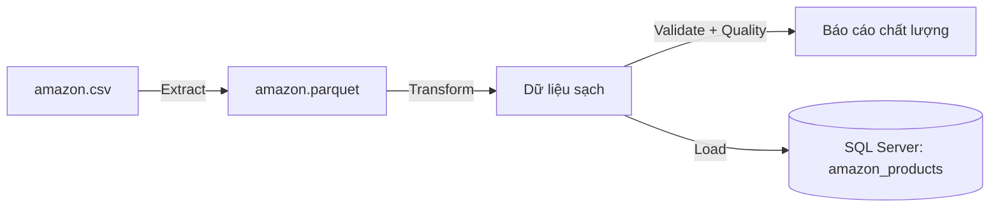

# Amazon Products ETL Pipeline

Pipeline tự động hóa quá trình đọc dữ liệu sản phẩm từ `amazon.csv`, xử lý làm sạch, kiểm tra chất lượng dữ liệu và nạp vào cơ sở dữ liệu SQL Server.

---

## Luồng xử lý (Pipeline Flow)



---

## Yêu cầu môi trường

- **Hệ điều hành**: Windows
- **Python**: 3.10+ (đã kiểm thử trên Python 3.14)
- **Database**: Microsoft SQL Server 2022
- **ODBC Driver**: ODBC Driver 18 for SQL Server
- Cài đặt các thư viện phụ thuộc:
  ```bash
  pip install -r requirements.txt
  ```

---

## Dữ liệu đầu vào

File dữ liệu gốc `amazon.csv` (dataset Amazon Products trên Kaggle) không được đưa lên git. 
- Tải dataset từ Kaggle hoặc nguồn cấp dữ liệu.
- Đặt file vào đúng đường dẫn: `data/raw/amazon.csv`.

---

## Cấu hình (`.env`)

Sao chép file `.env.example` thành `.env` tại thư mục gốc của dự án:

```bash
cp .env.example .env
```

Nội dung cấu hình mẫu trong `.env`:

```env
LOG_LEVEL=INFO

# Cấu hình kết nối SQL Server
DB_DRIVER=ODBC Driver 18 for SQL Server
DB_SERVER=localhost
DB_PORT=1433
DB_NAME=dw_amazon
DB_TRUSTED_CONNECTION=yes
DB_TRUST_SERVER_CERTIFICATE=yes
```

> **Lưu ý**: Hiện chỉ hỗ trợ Windows Authentication (`Trusted_Connection`). Chạy trên Linux hoặc Docker sẽ chưa hỗ trợ phương thức xác thực này. Đảm bảo database `dw_amazon` đã được tạo sẵn trên SQL Server trước khi chạy.

---

## Hướng dẫn thực thi

Chạy toàn bộ pipeline từ thư mục gốc:

```bash
python main.py
```

---

## Cấu trúc thư mục

```text
my_project_2/
├── data/
│   ├── raw/                 # Chứa dữ liệu gốc (amazon.csv - cần tự thêm vào)
│   ├── staging/             # Dữ liệu trung gian dạng Parquet (bị bỏ qua bởi git)
│   └── logs/                # File log quá trình chạy: etl_process.log
├── src/
│   ├── config.py            # Cấu hình kết nối SQL Server & SQLAlchemy Engine
│   ├── extract.py           # Đọc file CSV nguồn và lưu vào staging Parquet
│   ├── transform.py         # Làm sạch text, loại bỏ trùng lặp (deduplicate), chuẩn hóa số
│   ├── validate.py          # Kiểm tra 7 quy tắc ràng buộc dữ liệu
│   ├── quality.py           # Báo cáo thống kê chất lượng dữ liệu (NULL ratio, Unique, Min, Max, Mean, Median)
│   ├── load.py              # Nạp DataFrame vào bảng SQL Server
│   └── logger.py            # Thiết lập xoay vòng file log (RotatingFileHandler) và console
├── main.py                  # Điểm khởi chạy toàn bộ luồng ETL
├── requirements.txt         # Danh sách các thư viện Python
├── .env.example             # File mẫu biến môi trường
├── .gitignore               # Cấu hình các file bỏ qua không commit lên Git
└── README.md                # Tài liệu hướng dẫn dự án
```

---

## Kết quả đầu ra

- **Database**: `dw_amazon`
- **Bảng**: `amazon_products` (1,351 bản ghi sau khi loại bỏ trùng lặp và làm sạch)
  > Mỗi lần chạy sẽ ghi đè bảng `amazon_products` (chế độ `if_exists="replace"`).
- **Log chi tiết**: Báo cáo chất lượng và trạng thái từng bước được in ra màn hình console và lưu tại `data/logs/etl_process.log`.

---

## Hạn chế & Kế hoạch phát triển

- [ ] Hiện tại nạp dữ liệu ở dạng bảng phẳng (flat table). Kế hoạch tiếp theo: Chuẩn hóa theo mô hình **Star Schema** (`dim_product`, `dim_user`, `dim_category`, `fact_review`).
- [ ] Bổ sung xác thực SQL Server qua tài khoản SQL (Username/Password) phục vụ chạy môi trường Docker/Linux.
- [ ] Thiết lập lịch chạy tự động định kỳ (Airflow / Cron / Windows Task Scheduler).
- [ ] Bổ sung cơ chế ghi nhận và lưu trữ các bản ghi lỗi (Dead-letter / Quarantine table).
